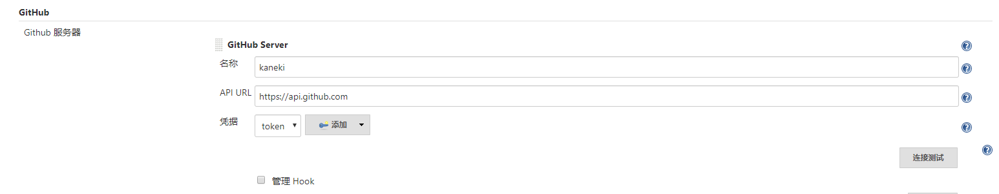
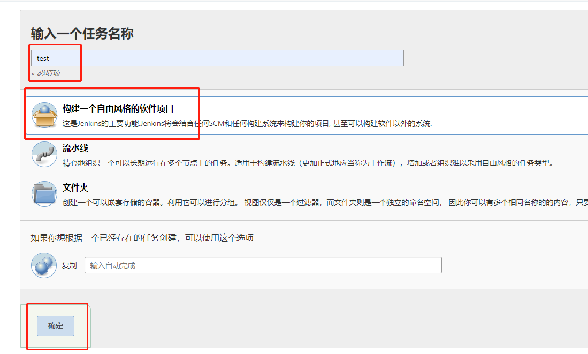
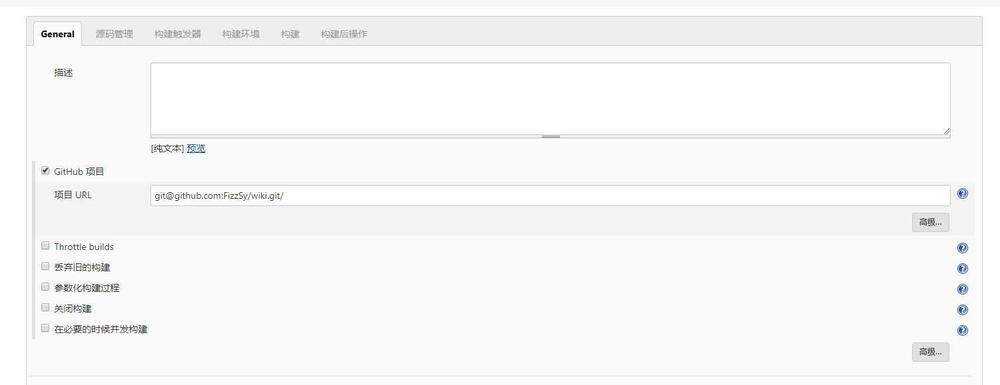
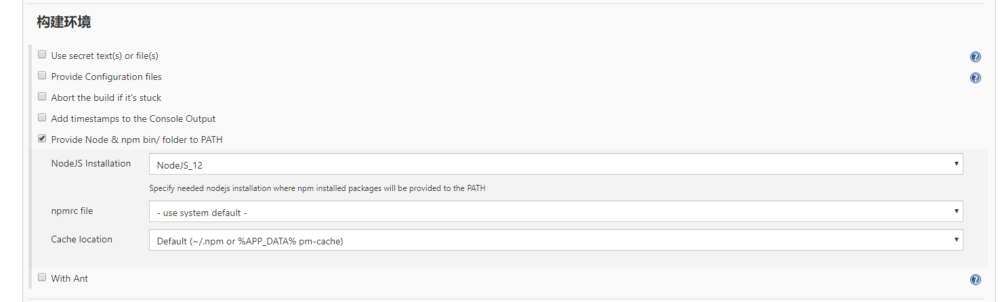
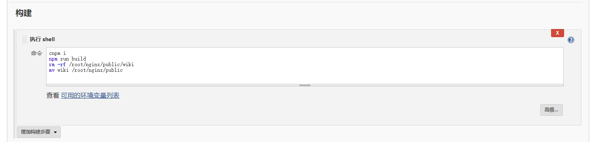
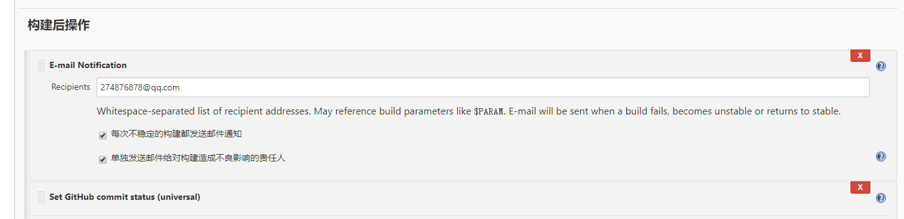
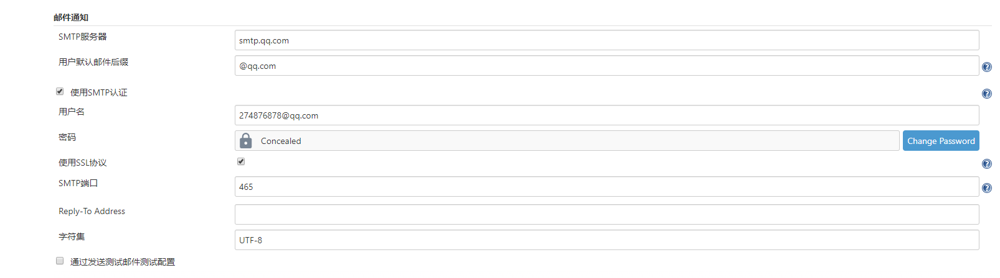

# jenkins

::: tip 简介
Jenkins 是一款开源 CI&CD 软件，用于自动化各种任务，包括构建、测试和部署软件。

Jenkins 支持各种运行方式，可通过系统包、Docker 或者通过一个独立的 Java 程序。
:::

## 1、安装

1、安装 java 环境

```
yum install yum-fastestmirror -y  #安装自动选择最快源的插件
#添加Jenkins源:
wget -O /etc/yum.repos.d/jenkins.repo http://jenkins-ci.org/redhat/jenkins.repo
rpm --import http://pkg.jenkins-ci.org/redhat/jenkins-ci.org.key
yum install jenkins               #安装jenkins
```

## 2、部署

[手把手教你搭建 Jenkins+Github 持续集成环境](https://github.com/muyinchen/woker/blob/master/%E9%9B%86%E6%88%90%E6%B5%8B%E8%AF%95%E7%8E%AF%E5%A2%83%E6%90%AD%E5%BB%BA/%E6%89%8B%E6%8A%8A%E6%89%8B%E6%95%99%E4%BD%A0%E6%90%AD%E5%BB%BAJenkins+Github%E6%8C%81%E7%BB%AD%E9%9B%86%E6%88%90%E7%8E%AF%E5%A2%83.md "手把手教你搭建Jenkins+Github持续集成环境")

[使用 jenkins 自动化打包部署 Vue 项目](https://www.jianshu.com/p/1d07b986ab2c "使用jenkins自动化打包部署Vue项目")

## 3、常用命令

```
service jenkins start                                   //启动jenkins
service jenkins restart                                 //重启启动jenkins
service jenkins stop                                    //停止jenkins
cat /var/lib/jenkins/secrets/initialAdminPassword       //查看jenkins登陆密码
vi /etc/sysconfig/jenkins                               //修改jenkins端口号
systemctl status jenkins.service                        //查看启动失败原因
```

## 4、首次启动缓慢等待解决方案

```
1、 vi /var/lib/jenkins/hudson.model.UpdateCenter.xml
2、将 https://updates.jenkins.io/update-center.json" 修改为 "http://mirror.xmission.com/jenkins/updates/update-center.json"     //优化插件安装速度
```

## 5、项目构建发布

1、先安装 git 插件 然后在系统配置自己的 git 仓库以及 token



2、创建构建任务



3、通用配置选择 gitHub 项目



4、选择构建环境为 Node(需安装 Node 插件以及配置系统 Node 版本)



5、编写 shell 命令打包发布到服务器



## 6、邮件通知

1、先安装邮件通知插件 然后在系统配置自己的邮箱以及 stmp

[配置邮箱 stmp](https://jingyan.baidu.com/article/ff411625674ca852e5823720.html)



2、构建后添加邮箱通知


