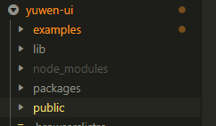

# NPM 组件库

::: tip 简介
使用 vue-cli 搭建个人项目组件库发布到 npm 上以供其他项目按需使用，提升开发效率。
:::

## 1、规划目录结构

```
|-- examples      // 原 src 目录，改成 examples 用作示例展示
|-- packages      // 新增 packages 用于编写存放组件
|-- lib           // 组件打包后存放的目录
|-- public        // 公共资源文件
```



## 2、配置项目以支持目录结构

### 2.1 新版 Vue CLI 支持使用 vue.config.js 中的 pages 选项构建一个多页面的应用。

这里使用 pages 修改入口到 examples

```js
module.exports = {
	// 修改 src 目录 为 examples 目录
	pages: {
		index: {
			entry: "examples/main.js",
			template: "public/index.html",
			filename: "index.html"
		}
	}
};
```

### 2.2、支持对 packages 目录的处理，修改配置中的 chainWebpack 选项

```js
module.exports = {
	// 修改 src 为 examples
	pages: {
		index: {
			entry: "examples/main.js",
			template: "public/index.html",
			filename: "index.html"
		}
	},
	// 扩展 webpack 配置，使 packages 加入编译
	chainWebpack: config => {
		config.module
			.rule("js")
			.include.add("/packages")
			.end()
			.use("babel")
			.loader("babel-loader")
			.tap(options => {
				// 修改它的选项...
				return options;
			});
	}
};
```

## 3、编写组件

### 3.1、创建一个新组件

在 packages 目录下，所有的单个组件都以文件夹的形式存储，所有这里创建一个目录 TglButton/
在 TglButton/ 目录下创建 src/ 目录存储组件源码
在 /TglButton 目录下创建 index.js 文件对外提供对组件的引用。

```js
// 导入组件，组件必须声明 name
import TglButton from "./src/index.vue";

// 为组件提供 install 安装方法，供按需引入
TglButton.install = function(Vue) {
	Vue.component(TglButton.name, TglButton);
	Vue.use(Button);
};

export default TglButton;
```

### 3.2、整合所有的组件，对外导出，即一个完整的组件库

修改 /packages/index.js 文件，对整个组件库进行导出。

```js
import TglButton from "./TglButton";
import TglInput from "./TglInput";
// 存储组件列表
const components = [TglButton, TglInput];
// 定义 install 方法，接收 Vue 作为参数。如果使用 use 注册插件，则所有的组件都将被注册
const install = function(Vue) {
	// 判断是否安装
	if (install.installed) return;
	// 遍历注册全局组件
	components.map(component => Vue.component(component.name, component));
};
// 判断是否是直接引入文件
if (typeof window !== "undefined" && window.vue) {
	install(window.vue);
}

export default {
	install,
	...components
};
```

## 5、编写示例

### 5.1、在示例中导入组件库

```js
import Vue from "vue";
import App from "./App.vue";
import router from "./router";
import store from "./store";

// 导入组件库
import yuwenUi from "../packages/index";
Vue.use(yuwenUi);

Vue.config.productionTip = false;

new Vue({
	router,
	store,
	render: h => h(App)
}).$mount("#app");
```

### 5.2、在示例中使用组件库中的组件

```html
<template>
	<div>
		<tgl-button></tgl-button>
		<tgl-input></tgl-input>
	</div>
</template>

<script>
	export default {};
</script>
```

## 6、发布组件库到 npm

### 6.1、package.json 中新增一条编译为库的命令

-   --target: 构建目标，默认为应用模式。这里修改为 lib 启用库模式。
-   --dest : 输出目录，默认 dist。这里我们改成 lib
-   [entry]: 最后一个参数为入口文件，默认为 src/App.vue。这里我们指定编译 packages/ 组件库目录。

```js
"scripts": {
	"lib": "vue-cli-service build --target lib --name yuwen-ui --dest lib packages/index.js"
}
```

执行编译库命令

```js
$ npm run lib
```

### 6.2、配置 package.json 文件中发布到 npm 的字段

-   name: 包名，该名字是唯一的。可在 npm 官网搜索名字，如果存在则需换个名字。
-   version: 版本号，每次发布至 npm 需要修改版本号，不能和历史版本号相同。
-   description: 描述。
-   main: 入口文件，该字段需指向我们最终编译后的包文件。
-   keyword：关键字，以空格分离希望用户最终搜索的词。
-   author：作者
-   private：是否私有，需要修改为 false 才能发布到 npm
-   license： 开源协议

```js
  "name": "yuwen-ui",
  "version": "0.1.4",
  "description": "基于vue的组件库",
  "private": false,
  "main": "lib/yuwen-ui.umd.min.js",
  "keyword": "yuwen-ui",
  "scripts": {
    "serve": "vue-cli-service serve",
    "build": "npm run lib && npm run components",
    "lint": "vue-cli-service lint",
    "lib": "vue-cli-service build --mode production --target lib --name yuwen-ui --dest lib packages/index.js",
    "components": "webpack --config webpack.components.js"
  },
```

### 6.3、添加 .npmignore 文件，设置忽略发布文件

我们发布到 npm 中，只有编译后的 lib 目录、package.json、README.md 才是需要被发布的。所以我们需要设置忽略目录和文件。

和 .gitignore 的语法一样，具体需要提交什么文件，看各自的实际情况。

```
# 忽略目录
examples/
packages/
public/

# 忽略指定文件
vue.config.js
babel.config.js
*.map

node_modules/
```

### 6.4、登录到 npm

```
npm config set registry http://registry.npmjs.org

npm login
```

### 6.4、发布到 npm

```
npm publish
```

## 7、使用新发布的组件库

### 7.1、安装

```
npm install yuwen-ui -S
```

### 7.1、全局引入

```js
1、在 main.js 引入并注册
import yuwenUi from 'yuwen-ui'
Vue.use(yuwenUi)

2、在组件中使用
<template>
  <tgl-button></tgl-button>
  <tgl-input></tgl-input>
</template>
```

### 7.2、按需引入

```js

1、安装babel-import-import
babel-import-import -D

2、在babel.config.js中配置需要按需引入的第三方依赖
"plugins": [
    [
        "import",
        {
            "libraryName": "yuwen-ui",
            "camel2DashComponentName": false  //不使用-连接
        }
    ]
]

3、在 main.js 引入并按需注册
import {TglButton,TglInput} from 'yuwen-ui'
Vue.use(TglButton)
Vue.use(TglInput)

4、在组件中使用
<template>
  <tgl-button></tgl-button>
  <tgl-input></tgl-input>
</template>
```
