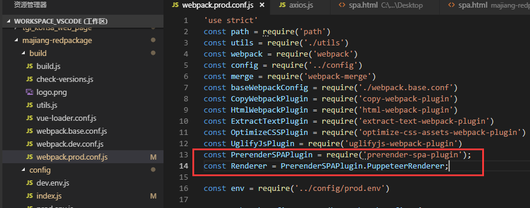
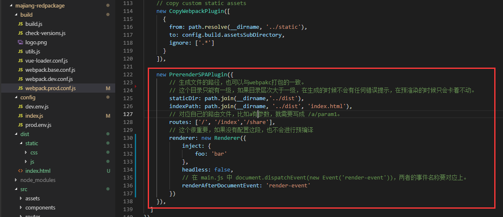
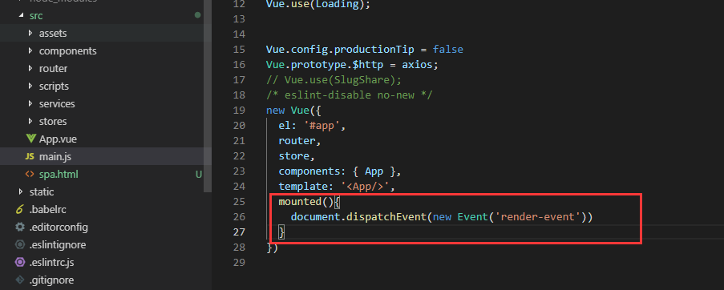
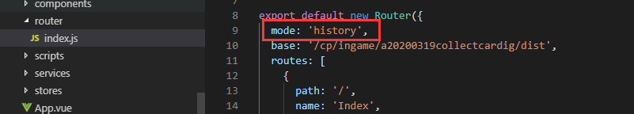
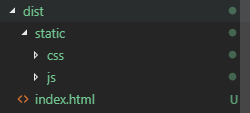
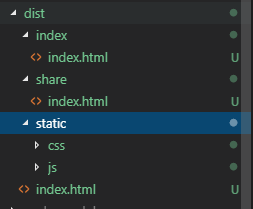
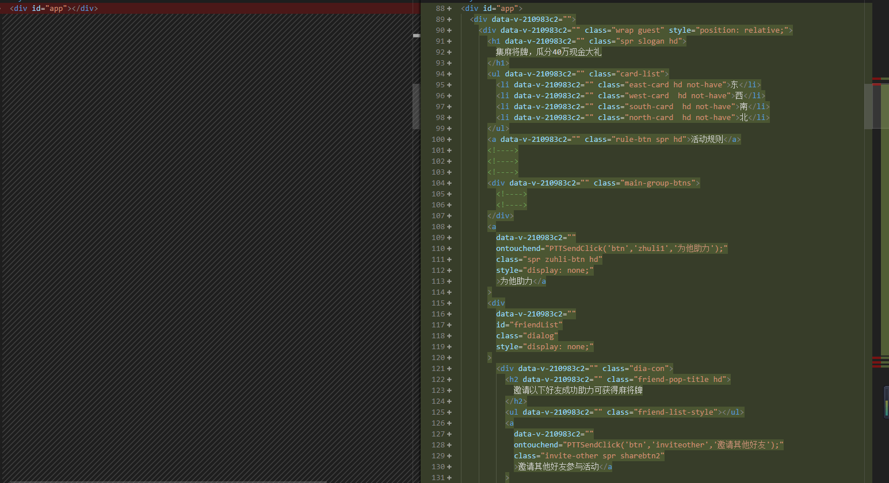

# 预渲染

::: tip 简介

Vue 的 SPA 为我们带来了极速的开发体验，极强的开发效率。可能唯一有些许不足的就是，当我们对 SEO 很在乎的时候，我们如何去处理 SEO 的需求。
:::

## 服务端渲染 or 预渲染

> 区别：

服务端渲染和预渲染的使用场景还是有较明显的区别的。预渲染的使用场景更多是我们所说的静态页面的形式，比如说这个网站。服务端渲染适用于大型的、页面数据处理较多且较为复杂的、与服务端有数据交互的功能型网站，一个明显的使用场景就是电商网站。

> 共同点：

1. 更好的 SEO
2. 更快的内容到达时间
3. 路由模式使用 history 模式

## 如何使用预渲染

### 1、引入预渲染插件



### 2、配置预渲染路由、打包路径



### 3、main.js 配置



### 4、路由模式修改



### 5、编译后与 SPA 对比：







## vue-meta

配置每个页面的 SEO 信息

```
npm install vue-meta-info -S
```

```js
import MetaInfo from 'vue-meta-info'
Vue.use(MetaInfo)

export default {
    // 这些代码会转成网页的meta标签里的内容
    metaInfo: {
        title: '标题',
        meta: [
            {
                name: 'keywords',
                content: '关键字'
            },
            {
                name: 'description',
                content: '网页描述'
            }
        ]
    }
```

## 原理

prerender-spa-plugin 利用了 Puppeteer 的爬取页面的功能。!
Puppeteer 是一个 Chrome 官方出品的 headlessChromenode 库。它提供了一系列的 API, 可以在无 UI 的情况下调用 Chrome 的功能, 适用于爬虫、自动化处理等各种场景。它很强大，所以很简单就能将运行时的 HTML 打包到文件中。原理是在 Webpack 构建阶段的最后，在本地启动一个 Puppeteer 的服务，访问配置了预渲染的路由，然后将 Puppeteer 中渲染的页面输出到 HTML 文件中，并建立路由对应的目录。
