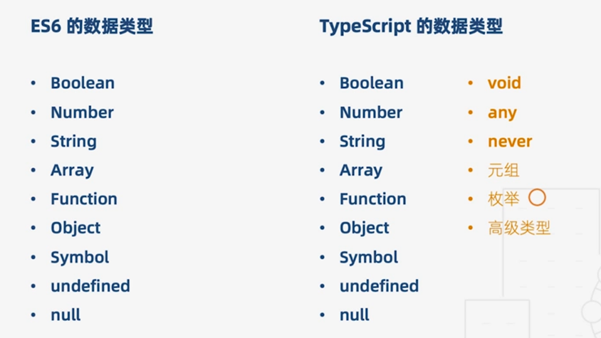

# TypeScript

::: tip 简介
TypeScript 具有类型系统，且是 JavaScript 的超集， 它可以编译成普通的 JavaScript 代码。

TypeScript 支持任意浏览器，任意环境，任意系统并且是开源的。
:::

## 1、类型

> typescript 是一门静态强类型语言，支持更多 ES6+新特性 也新增了许多类型



```typescript
let isDone: boolean = false; //布尔值

let decLiteral: number = 6; //数字

let name: string = "bob"; //字符串

let list: number[] = [1, 2, 3]; //数组

let list: Array<number> = [1, 2, 3]; //泛型数组

let x: [string, number]; //元祖
x = ["hello", 10]; // OK
x = [10, "hello"]; // Error

enum Color {
	Red,
	Green,
	Blue
} //枚举
let c: Color = Color.Green;

let notSure: any = 4; //任意值

function warnUser(): void {
	//没有返回值值的函数
	alert("This is my warning message");
}

let u: undefined = undefined; //undefined

let n: null = null; //null

function error(message: string): never {
	//抛出异常或死循环函数
	throw new Error(message);
	while (true) {}
}

let someValue: any = "this is a string"; //类型断言
let strLength: number = (someValue as string).length;
```

::: warning 提示
一旦声明了类型则不能将其赋值给不属于此类型的类型
:::

## 2、接口

```typescript
interface LabelledValue {
	label: string;
	width?: number; //可选属性
	color?: string;
	readonly x: number; //只读属性 不可修改
	[index: string]: number; //字符串索引签名
	length: number; // 可以，length是number类型
	name: string; // 错误，`name`的类型与索引类型返回值的类型不匹配
	(source: string, subString: string): boolean; //函数类型
}

function printLabel(labelledObj: LabelledValue) {
	console.log(labelledObj);
}

let myObj = {
	size: 10,
	label: "Size 10 Object",
	width: 100,
	x: 10,
	age: 12
};
printLabel(myObj);
```

## 3、函数

```typescript
let myAdd: (x:number, y:number) => number = (x: number, y: number): number { return x + y; };   //完整函数类型

function buildName(firstName = "Will", lastName: string,...restOfName: string[]) {                                      //可选参数、默认参数、剩余参数
    return firstName + " " + restOfName.join(" ");
}
let result4 = buildName("Tom",undefined, "Adams","Lucas", "MacKinzie");
```

## 4、配置

> tsc --init 生成 typescript 配置文件

```typescript
{
  "compilerOptions": {
    "allowUnreachableCode": true, // 不报告执行不到的代码错误。
    "allowUnusedLabels": false,	// 不报告未使用的标签错误
    "alwaysStrict": false, // 以严格模式解析并为每个源文件生成 "use strict"语句
    "baseUrl": ".", // 工作根目录
    "experimentalDecorators": true, // 启用实验性的ES装饰器
    "jsx": "react", // 在 .tsx文件里支持JSX
    "sourceMap": true, // 是否生成map文件
    "module": "commonjs", // 指定生成哪个模块系统代码
    "noImplicitAny": false, // 是否默认禁用 any
    "removeComments": true, // 是否移除注释
    "types": [ //指定引入的类型声明文件，默认是自动引入所有声明文件，一旦指定该选项，则会禁用自动引入，改为只引入指定的类型声明文件，如果指定空数组[]则不引用任何文件
      "node", // 引入 node 的类型声明
    ],
    "paths": { // 指定模块的路径，和baseUrl有关联，和webpack中resolve.alias配置一样
      "src": [ //指定后可以在文件之直接 import * from 'src';
        "./src"
      ],
    },
    "target": "ESNext", // 编译的目标是什么版本的
    "outDir": "./dist", // 输出目录
    "declaration": true, // 是否自动创建类型声明文件
    "declarationDir": "./lib", // 类型声明文件的输出目录
    "allowJs": true, // 允许编译javascript文件。
    "lib": [ // 编译过程中需要引入的库文件的列表
      "es5",
      "es2015",
      "es2016",
      "es2017",
      "es2018",
      "dom"
    ]
  },
  // 指定一个匹配列表（属于自动指定该路径下的所有ts相关文件）
  "include": [
    "src/**/*"
  ],
  // 指定一个排除列表（include的反向操作）
  "exclude": [
    "demo.ts"
  ],
  // 指定哪些文件使用该配置（属于手动一个个指定文件）
  "files": [
    "demo.ts"
  ]
}
```

## 5、在 vue 项目中使用 typescript

1、安装 ts 插件

```typescript
//安装vue的官方插件
npm i vue-class-component vue-property-decorator --save

//ts-loader typescript 将ts编译为js
npm i ts-loader typescript tslint tslint-loader tslint-config-standard --save-dev
```

::: tip 插件作用
vue-class-component：强化 Vue 组件，使用 TypeScript/装饰器 增强 Vue 组件  
vue-property-decorator：在 vue-class-component 上增强更多的结合 Vue 特性的装饰器  
ts-loader：TypeScript 为 Webpack 提供了 ts-loader，其实就是为了让 webpack 识别 .ts .tsx 文件  
tslint-loader 跟 tslint：我想你也会在.ts .tsx 文件 约束代码格式（作用等同于 eslint）  
tslint-config-standard：tslint 配置 standard 风格的约束  
:::

2、配置 webpack（若使用 vue-cli 创建 typescript 可忽略此步骤）

```typescript
webpack.config.js

//js统一转为ts
entry: {
  app: './src/main.ts'
},
//加上.ts文件后缀   引入文件可不写ts
resolve: {
    extensions: ['.js', '.vue', '.json', '.ts'],
},
//添加ts-loader 会根据目录下的tsconfig.json里的typescript配置对.ts文件的解析(类似于.babelrc)
module: {
  rules: [
    {
      test: /\.ts$/,
      exclude: /node_modules/,
      enforce: 'pre',
      loader: 'tslint-loader'
    },
    {
      test: /\.tsx?$/,
      loader: 'ts-loader',
      exclude: /node_modules/,
      options: {
        appendTsSuffixTo: [/\.vue$/],
      }
    },
// 复制以上的
  }
}
```

3、添加声明文件

> ts 默认只识别\*.ts 文件，添加声明文件是让 ts 识别.vue

```typescript
declare module "*.vue" {
	import Vue from "vue";
	export default Vue;
}
```

4、改造.vue 文件

1、script 标签改为 lang="ts"  
2、mixins、components 放入装饰器 Component 中，vue-class-component 对 Vue 组件进行了一层封装，让 Vue 组件语法在结合了 TypeScript 语法之后更加扁平化  
3、定义组件内的变量、方法直接写即可  
4、计算属性 computed 改为 get  
5、父子组件属性、监听器、vuex 改为装饰器写法

```vue
<template>
	<div>
		<input v-model="msg" />
		<p>msg: {{ msg }}</p>
		<p>computed msg: {{ computedMsg }}</p>
		<button @click="greet">Greet</button>
	</div>
</template>

<script lang="ts">
import Vue from "vue";
import Component from "vue-class-component";

@Component({
	mixins,
	components
})
export default class App extends Vue {
	//父子组件属性传值
	@Prop()
	propA: number = 1;

	// 初始化数据
	msg = 123;

	// 声明周期钩子
	mounted() {
		this.greet();
	}

	// 计算属性
	get computedMsg() {
		return "computed " + this.msg;
	}

	//监听器
	@Watch("child")

	// 方法
	greet() {
		alert("greeting: " + this.msg);
	}
}
</script>
```
