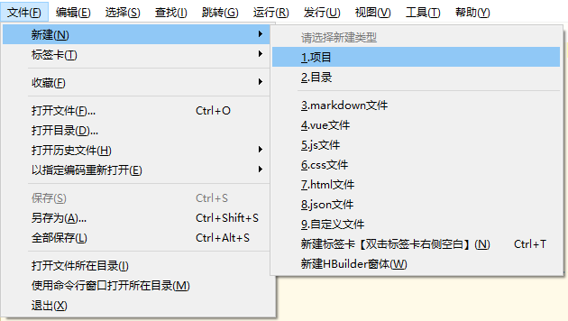

# uni-app

::: tip 介绍
uni-app 是一个使用 Vue.js 开发所有前端应用的框架，开发者编写一套代码，可发布到 iOS、Android、H5、以及各种小程序（微信/支付宝/百度/头条/QQ/钉钉）等多个平台。
:::

## 1、创建项目

### 1.通过 HBuilderX 可视化界面

HBuilderX 是通用的前端开发工具，但为 uni-app 做了特别强化。

下载 App 开发版，可开箱即用；如下载标准版，在运行或发行 uni-app 时，会提示安装 uni-app 插件，插件下载完成后方可使用。

如使用 cli 方式创建项目，可直接下载标准版，因为 uni-app 编译插件被安装到项目下了




### 运行 uni-app 到各平台


### 2.通过 vue-cli 命令行

```
npm install -g @vue/cli                                 //全局安装vue-cli脚手架
vue create -p dcloudio/uni-preset-vue my-project        //创建uni-app
```

### 选择自己所需的模板


### 运行并发布 uni-app

```
npm run dev:%PLATFORM%
npm run build:%PLATFORM%
```

%PLATFORM% 可取值如下：

| 值         | 平台         |
| ---------- | ------------ |
| h5         | H5           |
| mp-alipay  | 支付宝小程序 |
| mp-baidu   | 百度小程序   |
| mp-weixin  | 微信小程序   |
| mp-toutiao | 头条小程序   |
| mp-qq      | qq 小程序    |

## 2、开发规范

为了实现多端兼容，综合考虑编译速度、运行性能等因素，uni-app 约定了如下开发规范：

-   页面文件遵循 Vue 单文件组件 (SFC) 规范
-   组件标签靠近小程序规范，详见 uni-app 组件规范
-   接口能力（JS API）靠近微信小程序规范，但需将前缀 wx 替换为 uni，详见 uni-app 接口规范
-   数据绑定及事件处理同 Vue.js 规范，同时补充了 App 及页面的生命周期
-   为兼容多端运行，建议使用 flex 布局进行开发

## 3、目录结构

```
┌─components            uni-app组件目录
│  └─comp-a.vue         可复用的a组件
├─hybrid                存放本地网页的目录，详见
├─platforms             存放各平台专用页面的目录，详见
├─pages                 业务页面文件存放的目录
│  ├─index
│  │  └─index.vue       index页面
│  └─list
│     └─list.vue        list页面
├─static                存放应用引用静态资源（如图片、视频等）的目录，注意：静态资源只能存放于此
├─wxcomponents          存放小程序组件的目录，详见
├─main.js               Vue初始化入口文件
├─App.vue               应用配置，用来配置App全局样式以及监听 应用生命周期
├─manifest.json         配置应用名称、appid、logo、版本等打包信息，详见
└─pages.json            配置页面路由、导航条、选项卡等页面类信息，详见
```

## 4、生命周期

### uni-app 的应用周期与生命周期基本与微信小程序保持一致

## 5、语法、API

### 语法参照 vue、API 参照微信小程序

## 6、运行环境判断

### 开发环境和生产环境

uni-app 可通过 process.env.NODE_ENV 判断当前环境是开发环境还是生产环境。一般用于连接测试服务器或生产服务器的动态切换。

```js
if (process.env.NODE_ENV === "development") {
	console.log("开发环境");
} else {
	console.log("生产环境");
}
```

## 7、判断平台

```js
// #ifdef H5
alert("只有h5平台才有alert方法");
// #endif

switch (uni.getSystemInfoSync().platform) {
	case "android":
		console.log("运行Android上");
		break;
	case "ios":
		console.log("运行iOS上");
		break;
	default:
		console.log("运行在开发者工具上");
		break;
}
```
